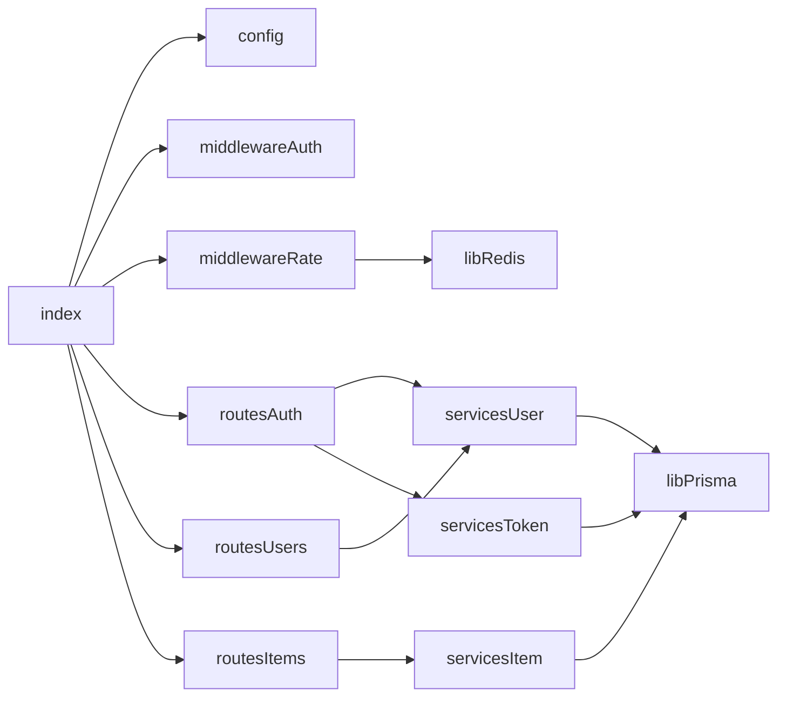
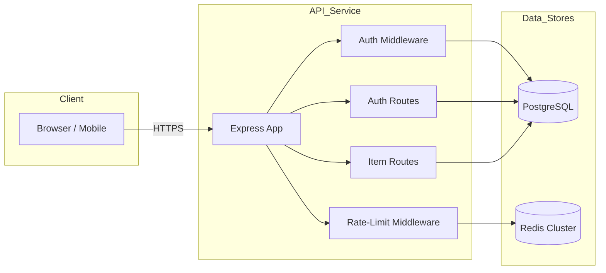

# 1. Executive Summary  
This document defines the full scope for a REST API microservice providing user authentication (JWT-based), IP- and user-based rate limiting, CRUD operations for a core `Item` resource, a PostgreSQL relational data model via Prisma ORM, and end-to-end test coverage with Jest and Supertest. The chosen tech stack is TypeScript + Node.js (v20 LTS) with Express (v4.21.0), Prisma (v4.x) + PostgreSQL (13+), Redis (7+) for distributed rate limiting, and JSON Web Tokens (`jsonwebtoken` v9.0.0). The service is container-ready and designed for horizontal scaling.

---

# 2. Requirements  

## 2.1 Functional Requirements (User Stories)  
1. **User Registration**  
   - As a new user, I can register with email/password to obtain an account.  
2. **User Login**  
   - As a registered user, I can log in and receive a JWT access token.  
3. **Token Refresh**  
   - As a user, I can refresh my JWT with a rotating refresh token.  
4. **Item CRUD**  
   - As an authenticated user, I can create, read, update, and delete `Item` resources.  
5. **Rate Limit Enforcement**  
   - As an API consumer, my requests are limited by IP (100 requests/15 min) and by user (1,000 requests/hour).  

## 2.2 Non-Functional Requirements  
- **Performance**:  
  - 95th percentile response time ≤ 200 ms under 1,000 RPS.  
- **Security**:  
  - Passwords hashed (bcrypt ≥ 12 rounds).  
  - Transport-level TLS mandatory.  
  - JWT signed with RS256, 15 min expiry, refresh tokens 7 days.  
- **Scalability**:  
  - Stateless API behind load balancer.  
  - Redis cluster for rate-limit store.  
- **Availability**:  
  - 99.9% SLA.  
- **Test Coverage**:  
  - ≥ 90% coverage (unit + integration).  

---

# 3. Architecture Decision Records  

| ADR | Decision | Alternatives Considered | Rationale |
|----|----------|-------------------------|-----------|
| ADR-001 | Node.js + TypeScript + Express | Go + Fiber, Spring Boot | Familiarity, ecosystem maturity, rich middleware support |
| ADR-002 | PostgreSQL via Prisma ORM | MySQL, MongoDB | Strong relational integrity, Prisma type safety |
| ADR-003 | Redis for Rate Limiting | In-memory store, Memcached | Distributed counters, persistence, proven middleware |
| ADR-004 | JWT (RS256) | OAuth2, Session Cookies | Stateless, microservice-friendly, no central session store |
| ADR-005 | Jest + Supertest for Testing | Mocha, Chai, AVA | Popular, TypeScript support, snapshot testing |

---

# 4. Data Model  

```mermaid
erDiagram
    USER ||--o{ ITEM : owns
    USER {
      UUID id PK
      String email UQ
      String passwordHash
      DateTime createdAt
      DateTime updatedAt
    }
    ITEM {
      UUID id PK
      String name
      String description
      UUID ownerId FK
      DateTime createdAt
      DateTime updatedAt
    }
    REFRESH_TOKEN {
      UUID id PK
      UUID userId FK
      String token
      DateTime expiresAt
      Boolean revoked
    }
```

## 4.1 Database Schema (Prisma)  

```prisma
model User {
  id            String    @id @default(uuid())
  email         String    @unique
  passwordHash  String
  items         Item[]
  refreshTokens RefreshToken[]
  createdAt     DateTime  @default(now())
  updatedAt     DateTime  @updatedAt
}

model Item {
  id          String   @id @default(uuid())
  name        String
  description String?
  owner       User     @relation(fields: [ownerId], references: [id])
  ownerId     String
  createdAt   DateTime @default(now())
  updatedAt   DateTime @updatedAt
}

model RefreshToken {
  id        String   @id @default(uuid())
  token     String   @unique
  user      User     @relation(fields: [userId], references: [id])
  userId    String
  expiresAt DateTime
  revoked   Boolean  @default(false)
}
```

---

# 5. API Surface  

| Method | Path                  | Auth       | Request Body                                    | Response Body                            |
|--------|-----------------------|------------|-------------------------------------------------|------------------------------------------|
| POST   | /auth/register        | Public     | `{ email: string; password: string }`           | `201 { id, email }`                      |
| POST   | /auth/login           | Public     | `{ email: string; password: string }`           | `200 { accessToken, refreshToken }`      |
| POST   | /auth/refresh         | Public     | `{ refreshToken: string }`                      | `200 { accessToken }`                    |
| POST   | /auth/logout          | Auth       | `{ refreshToken: string }`                      | `204`                                    |
| GET    | /users/me             | Bearer JWT | —                                               | `200 { id, email, createdAt }`           |
| POST   | /items                | Bearer JWT | `{ name: string; description?: string }`        | `201 Item`                               |
| GET    | /items                | Bearer JWT | —                                               | `200 Item[]`                             |
| GET    | /items/:id            | Bearer JWT | —                                               | `200 Item`                               |
| PUT    | /items/:id            | Bearer JWT | `{ name?: string; description?: string }`       | `200 Item`                               |
| DELETE | /items/:id            | Bearer JWT | —                                               | `204`                                    |

---

# 6. Component Breakdown  

| Component               | Responsibility                                | Complexity |
|-------------------------|-----------------------------------------------|------------|
| src/index.ts           | Express app bootstrap                         | S          |
| src/config/            | Env & config loader                           | S          |
| src/middleware/auth.ts | JWT verification & user injection             | M          |
| src/middleware/rate.ts | IP & user rate limiter with Redis store       | M          |
| src/routes/auth.ts     | Register, login, refresh, logout routes       | M          |
| src/routes/users.ts    | `/users/me` endpoint                          | S          |
| src/routes/items.ts    | CRUD for `Item`                               | M          |
| src/services/user.ts   | User business logic, hashing                  | M          |
| src/services/item.ts   | Item CRUD business logic                      | M          |
| src/services/token.ts  | Refresh token issuance, revocation            | M          |
| src/lib/prisma.ts      | Prisma client initialization                  | S          |
| src/lib/redis.ts       | Redis client & rate‐limit store               | S          |
| tests/                  | Jest + Supertest integration/unit tests       | L          |

---

# 7. Dependency Graph  



---

# 8. Phase Plan  

| Phase | Milestone                                     | Exit Criteria                                  |
|-------|-----------------------------------------------|-----------------------------------------------|
| 1     | Project scaffolding, config, Prisma setup     | `npm run dev` boots; DB migrations run        |
| 2     | Auth endpoints (register/login/refresh/logout) | JWT flow tested (unit + integration)          |
| 3     | Item CRUD endpoints                           | CRUD covered by tests; Prisma models ready    |
| 4     | Rate limiting middleware                      | Manual pressure test; Redis counters working  |
| 5     | Test coverage & CI/CD                         | ≥ 90% coverage; GitHub Actions passing tests  |
| 6     | Documentation & Deployment scripts            | OpenAPI spec; Dockerfile; helm chart         |

---

# 9. Risk Register  

| Risk                                   | Probability | Impact   | Mitigation                                         |
|----------------------------------------|-------------|----------|----------------------------------------------------|
| JWT secret leakage                     | Medium      | High     | Use RS256 keys stored in KMS; rotate keys monthly  |
| Redis outage                           | Low         | Medium   | Fallback to in-memory limiter; auto‐reconnect      |
| DB schema mismatch in production       | Medium      | High     | Enforce CI migration tests; use feature flags      |
| Rate-limit false positives             | Medium      | Medium   | Allow bursts; expose `Retry-After` header          |
| Insufficient test coverage             | Low         | Medium   | Coverage gates in CI; periodic coverage audits     |

---

# 10. High-Level Architecture Diagram  

